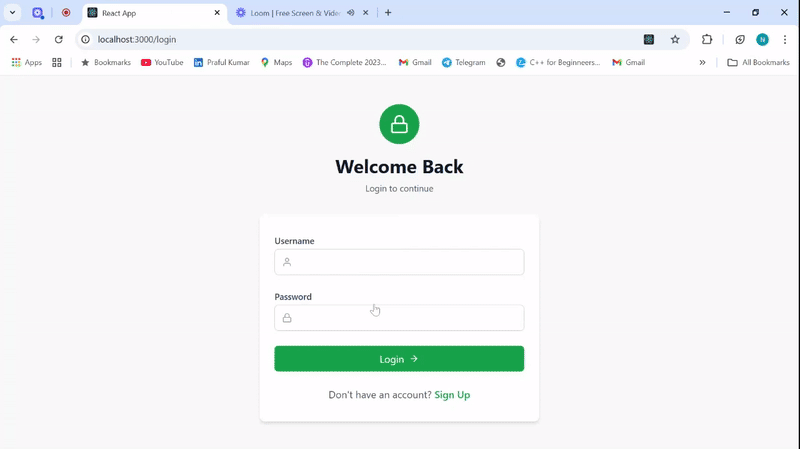
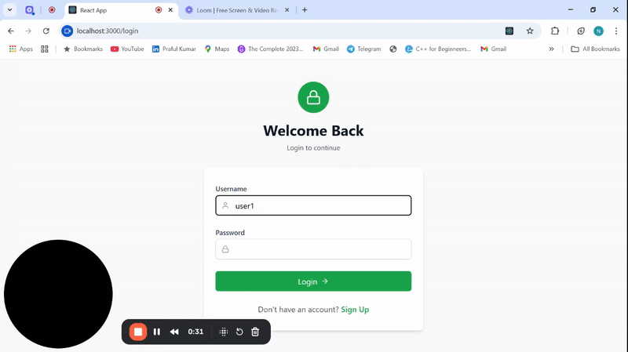

# Secure Auth Spring React

This project is a secure authentication system built with a **Spring Boot** backend and a **React** frontend.

---

## Project Overview

- **Backend:** Spring Boot application for authentication and API services.
- **Frontend:** React app for user interface and client-side logic.

---

## Prerequisites

- **Java Development Kit (JDK)** 11 or higher
- **Maven** (for backend dependencies)
- **Node.js** and **npm** (for frontend dependencies)
- **Eclipse IDE** (for backend development)
- **VS Code** (for frontend development)
- **Git** (to clone the repository)

---

## Getting Started

### 1. Clone the repository

```bash
git clone https://github.com/CodeFear5/secure-auth-spring-react.git
cd secure-auth-spring-react
Backend Setup (Spring Boot)
Open in Eclipse
Open Eclipse IDE.

Select File > Import > Existing Maven Projects.

Browse to the project folder (secure-auth-spring-react/backend or wherever your backend code is).

Finish the import.

Run the backend server
Locate the main Spring Boot application class (annotated with @SpringBootApplication).

Right-click on the class > Run As > Java Application.

The backend server will start on http://localhost:8080 (default port).

Backend Configuration
Backend uses Maven for dependencies.

You can modify the application properties in src/main/resources/application.properties if needed (e.g., database URL, ports).

Make sure your local database (e.g., MySQL, MongoDB) is running if your app uses one.

Frontend Setup (React)
Open in VS Code
 

Open the project folder (secure-auth-spring-react/client ).

Install dependencies
Open the terminal in VS Code and run:


npm install
Run the frontend
Start the React development server:

 
npm start
This will start the frontend on http://localhost:3000 by default and open it in your browser.

Connecting Frontend and Backend
The React app is configured to communicate with the backend API running on http://localhost:8080.

Make sure the backend server is running before using the frontend.

Troubleshooting
If ports 3000 or 8080 are busy, update the ports in React (package.json) or Spring Boot (application.properties).

For backend errors, check Eclipse console logs.

For frontend errors, check VS Code terminal and browser console.

Technologies Used
Backend: Java, Spring Boot, Maven

Frontend: React, JavaScript, npm

IDE: Eclipse (backend), Visual Studio Code (frontend)

Contact
For any questions or issues, please open an issue or contact [Nagesh B C / nageshbc55@gmail.com].


# Project Demo

## Demo 1


## Demo 2

